<div align="center">


<strong>>> <i>A generic service to send, retry, and manage webhooks.</i> <<</strong>

[](https://forthebadge.com)
[](https://forthebadge.com)
[](https://forthebadge.com)
</div>


## Table of Contents

* [Description](#description)
  * [What?](#what)
  * [Why?](#why)
  * [How?](#how)
* [Installation](#installation)
* [Usage](#usage)
  * [Exploring the Interactive API Docs](#exploring-the-interactive-api-docs)
* [Sending A Webhook Via cURL](#sending-a-webhook-via-curl)
* [Sending A Webhook Via Python](#sending-a-webhook-via-python)
  * [Exploring the Container Logs](#exploring-the-container-logs)
  * [Scaling Up the Service](#scaling-up-the-service)


## Description

### What?

Hook Slinger acts as a simple service that lets you send, retry, and manage event-triggered POST requests, aka webhooks. It provides a fully self-contained docker image that is easy to orchestrate, manage, and scale.

### Why?

Technically, a webhook is a mere POST request—triggered by a system—when a particular event occurs. The following diagram shows how a simple POST request takes the webhook nomenclature when invoked by an event trigger.

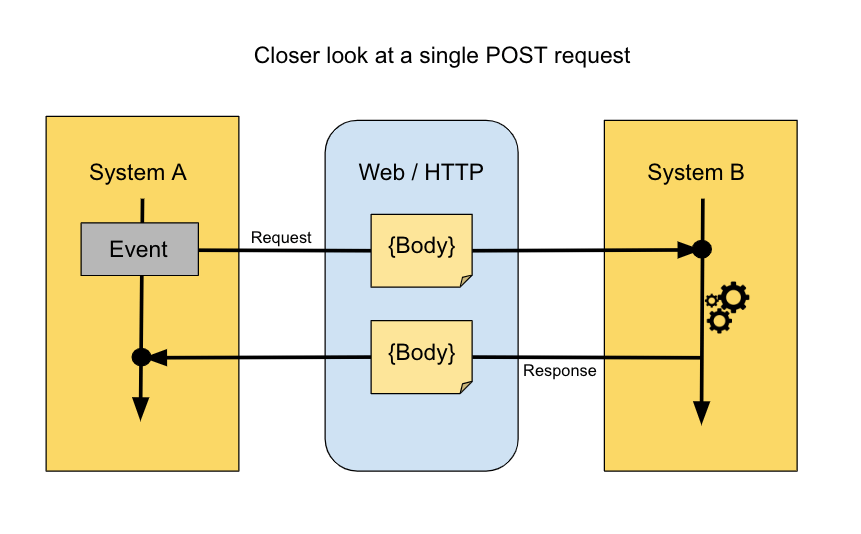

However, there are a few factors that make it tricky to manage the life cycle of a webhook, such as:

* Dealing with system failures on both the sending and the receiving end.
* Managing HTTP timeouts.
* Handling exceptions and retrying the requests without overwhelming the recipients.
* Avoiding retry loop on the sending side.
* Monitoring and providing scopes for manual interventions.
* Scaling the system quickly; either vertically or horizontally.
* Decoupling webhook management logic from your primary application logic.

Properly dealing with these concerns can be cumbersome; especially when sending webhooks is just another small part of your application and you just want it to work without you having to deal with all the hairy details every time. Hook Slinger aims to alleviate this pain point.

### How?

Hook Slinger exposes a single endpoint where you can post your webhook payload, destination URL, auth details, and it'll make the POST request for you asynchronously in the background. Under the hood, the service uses:

* [FastAPI](https://fastapi.tiangolo.com/) to provide a [Uvicorn](https://www.uvicorn.org/) powered [ASGI](https://asgi.readthedocs.io/en/latest/#) server.

* [Redis](https://redis.io/) and [RQ](https://python-rq.org/docs/jobs/) for implementing message queues that provide the asynchrony and robust failure handling mechanisms.

* [Rqmonitor](https://github.com/pranavgupta1234/rqmonitor) to provide a dashboard for monitoring the status of the webhooks and manually retrying the failed jobs.

* [Rich](https://github.com/willmcgugan/rich) to make the container logs colorful and more human friendly.

The simplified app architecture looks something this:

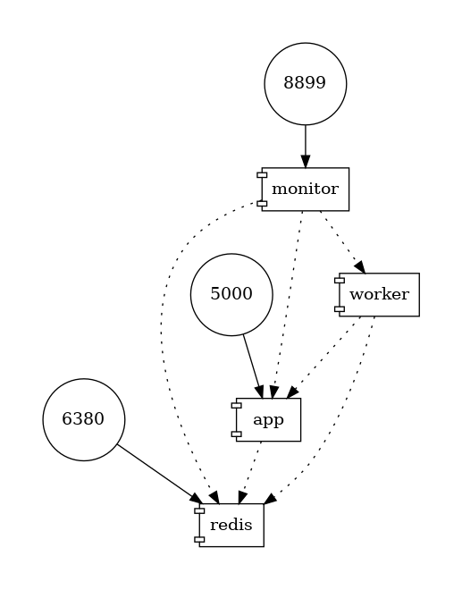

In the above image, the webhook payload is first sent to the `app` and the `app` leverages the `worker` instance to make the POST request. Redis DB is used for fast bookkeeping and async message queue implementation. The `monitor` instance provides a GUI to monitor and manage the webhooks. Multiple `worker` instances can be spawned to achieve linear horizontal scale-up.

## Installation

* Make sure you've got [Docker](https://www.docker.com/) and [Docker Compose](https://docs.docker.com/compose/) installed in your system.

* Clone the repository and head over to the root directory.

* To start the orchestra, run:

    ```
    make start_servers
    ```

    This will:

    * Start an `app` server that can be accessed from port `5000`.

    * Start an Alpine-based Redis server that exposes port `6380`.

    * Start a single `worker` that will carry out the actual tasks.

    * Start a `rqmonitor` instance that opens port `8899`.

* To shut down everything, run:

    ```
    make stop_servers
    ```

*TODO: Generalize it more before making it installable with a `docker pull` command.*

## Usage

### Exploring the Interactive API Docs

To try out the entire workflow interactively, head over to the following URL on your browser:

```
http://localhost:5000/docs
```

You should see a panel like this:

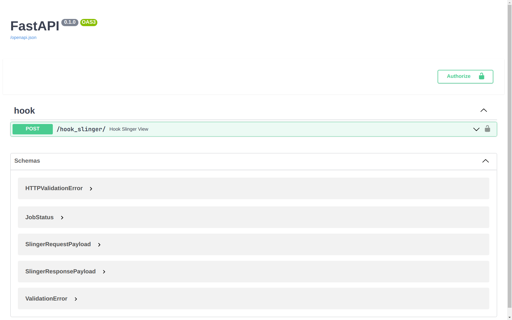

This app implements a rudimentary token-based authentication system where you're expected to send an API token by adding `Authorization: Token <token_value>` field to your request header. To do that here, click the `POST /hook_slinger/` ribbon and that will reveal the API description like this:

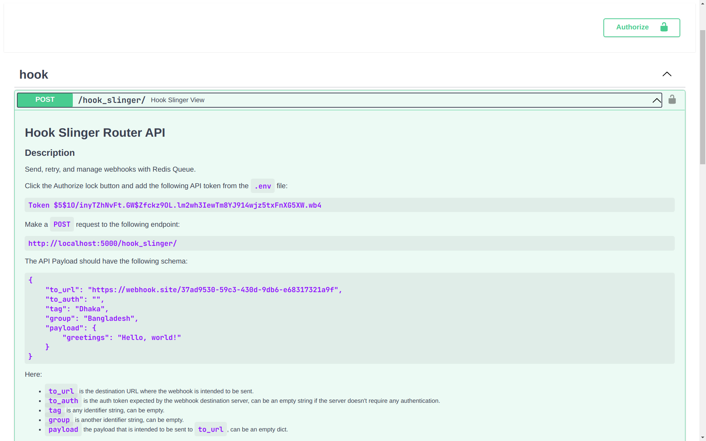

Copy the default token value from the description corpus, then click the green button on the top right that says **Authorize**, and paste the value in the prompt box. Click the **Authorize** button again and that'll conclude the login step. In your production application, you should implement a robust authentication system or at least change this default token.

To send a webhook, you'll need a URL where you'll be able to make the POST request. For this demonstration, let's pick this [webhook site](https://webhook.site/) service to monitor the received webhooks. It gives you a unique URL against which you'll be able to make the POST requests and monitor them in a dashboard like this:


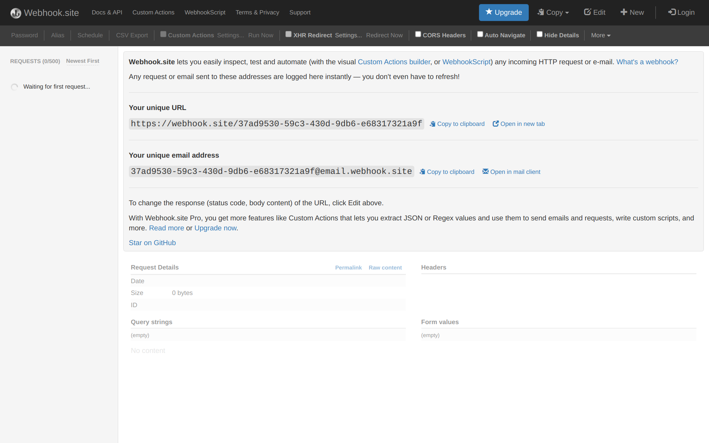

On the API docs page, click the **Try it out** button near the **request body** section:

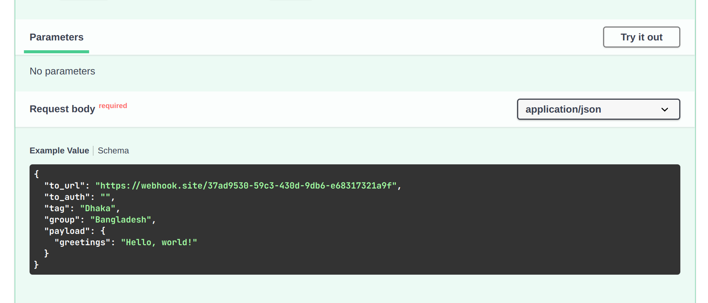

This should reveal a panel like the following one where you can make your request:


Notice that the section is prefilled with an example request payload. You can use this exact payload to make a request. Go ahead and click the execute button. If you scroll down a little, you'll notice the HTTP response:


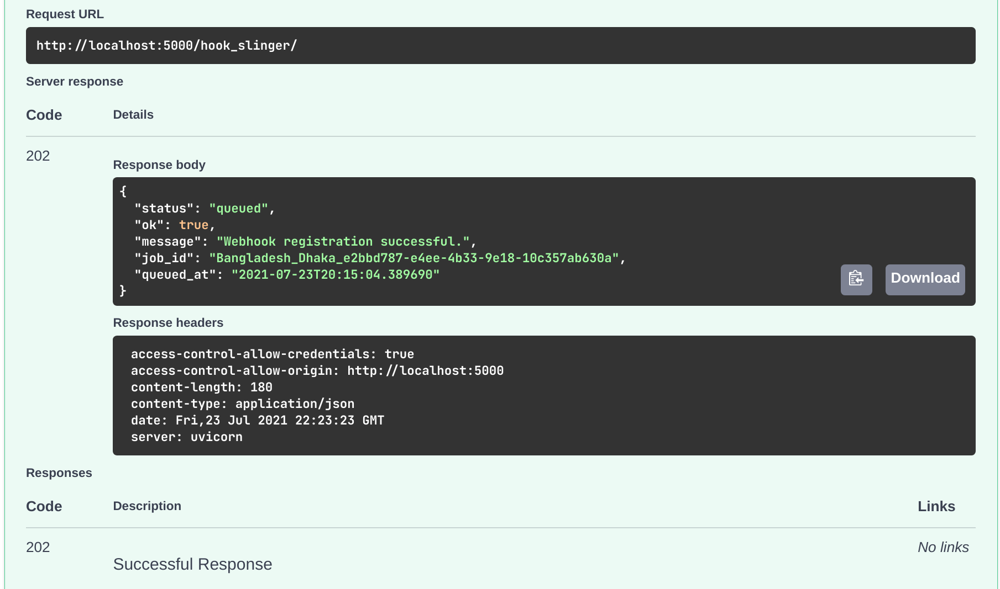

Now, if you head over to the [webhook site](https://webhook.site/#!/37ad9530-59c3-430d-9db6-e68317321a9f/7c9b390a-4546-4b42-8472-9adee9bb3568/1) URL, you should be able to see your API payload:


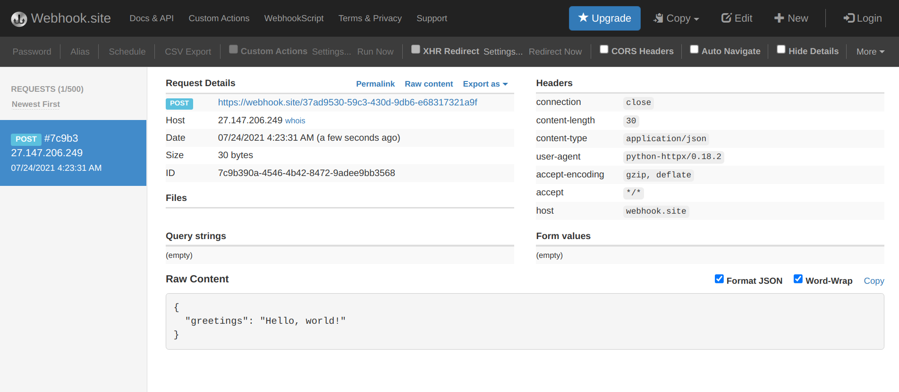

To monitor the webhook tasks, head over to the following URL:

```
http://localhost:8899/
```

You should be presented with a GUI like this:


If you click **Workers** on the left panel, you'll be presented with a panel where you can monitor all the workers:

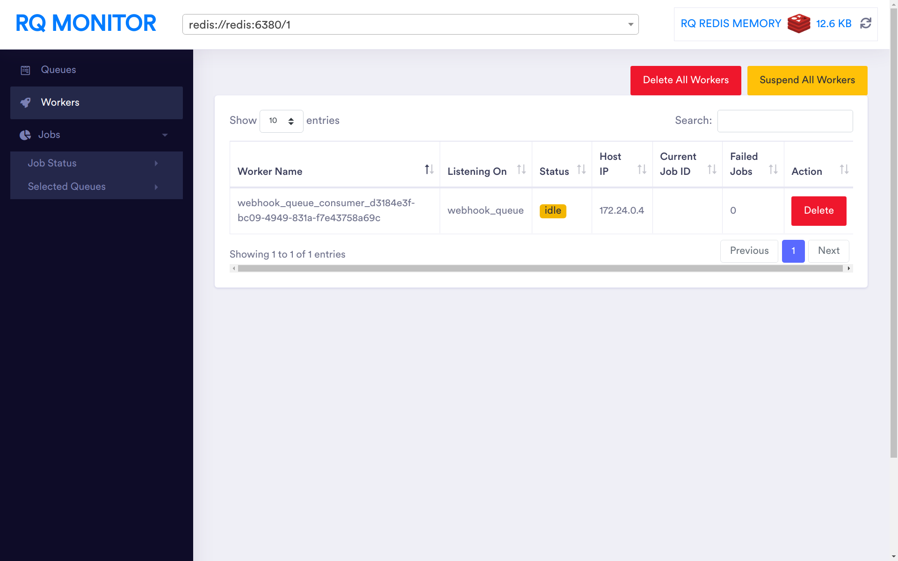


The **Jobs** panel lists all the tasks, and from there you'll be able to requeue a failed job. By default, Hook Slinger retries a failed job 3 times with 5 seconds linear backoff. However, this can be configured using environment variables in the `.env` file.


## Sending A Webhook Via cURL

Run the following command on your terminal; this assumes that you haven't changed the auth token (you should):

```sh
curl -X 'POST' \
  'http://localhost:5000/hook_slinger/' \
  -H 'accept: application/json' \
  -H 'Authorization: Token $5$1O/inyTZhNvFt.GW$Zfckz9OL.lm2wh3IewTm8YJ914wjz5txFnXG5XW.wb4' \
  -H 'Content-Type: application/json' \
  -d '{
  "to_url": "https://webhook.site/37ad9530-59c3-430d-9db6-e68317321a9f",
  "to_auth": "",
  "tag": "Dhaka",
  "group": "Bangladesh",
  "payload": {
    "greetings": "Hello, world!"
  }
}' | python -m json.tool
```

You should expect the following output:

```json
{
    "status": "queued",
    "ok": true,
    "message": "Webhook registration successful.",
    "job_id": "Bangladesh_Dhaka_a07ca786-0b7a-4029-bac0-9a7c6eb68a98",
    "queued_at": "2021-07-23T20:15:04.389690"
}
```

## Sending A Webhook Via Python

For this purpose, you can use an HTTP library like [httpx](https://www.python-httpx.org).

Make the request with the following script:

```python

import asyncio
from http import HTTPStatus
from pprint import pprint

import httpx


async def send_webhook() -> None:

    wh_payload = {
        "to_url": "https://webhook.site/aa7e2e7e-a62d-4505-8879-13bd806da6d5",
        "to_auth": "",
        "tag": "Dhaka",
        "group": "Bangladesh",
        "payload": {"greetings": "Hello, world!"},
    }

    async with httpx.AsyncClient(http2=True) as session:
        headers = {
            "Content-Type": "application/json",
            "Authorization": (
                "Token $5$1O/inyTZhNvFt.GW$Zfckz9OL.lm2wh3IewTm8YJ914wjz5txFnXG5XW.wb4"
            ),
        }

        response = await session.post(
            "http://localhost:5000/hook_slinger",
            headers=headers,
            json=wh_payload,
        )

        # Hook Slinger returns http code 202, accepted, for a successful request.
        if response.status_code == HTTPStatus.ACCEPTED:
            result = response.json()
            pprint(result)


asyncio.run(send_webhook())

```

This should return a similar response as before:

```
{
    'job_id': 'Bangladesh_Dhaka_139fc35a-d2a5-4d01-a6af-e980c52f55bc',
    'message': 'Webhook registration successful.',
    'ok': True,
    'queued_at': '2021-07-23T20:15:04.389690',
    'status': 'queued'
}
```

### Exploring the Container Logs

Hook Slinger overloads the Python root logger to give you a colorized and user-friendly logging experience. To explore the logging messages of the application server, run:

```
make app_logs
```

Notice the colorful logs cascading down from the app server:

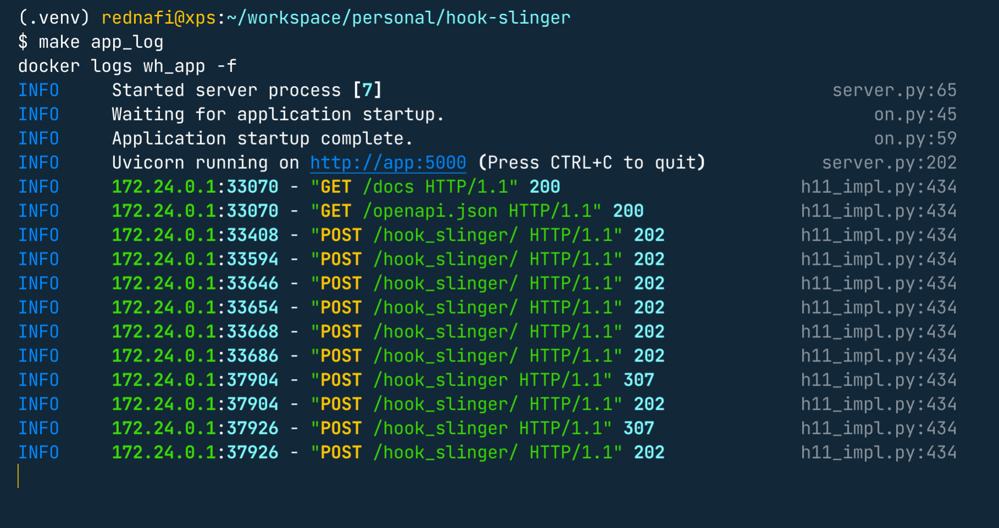

Now, to explore the worker instance logs, in a separate terminal, run:

```
make worker_logs
```

You should see something like this:

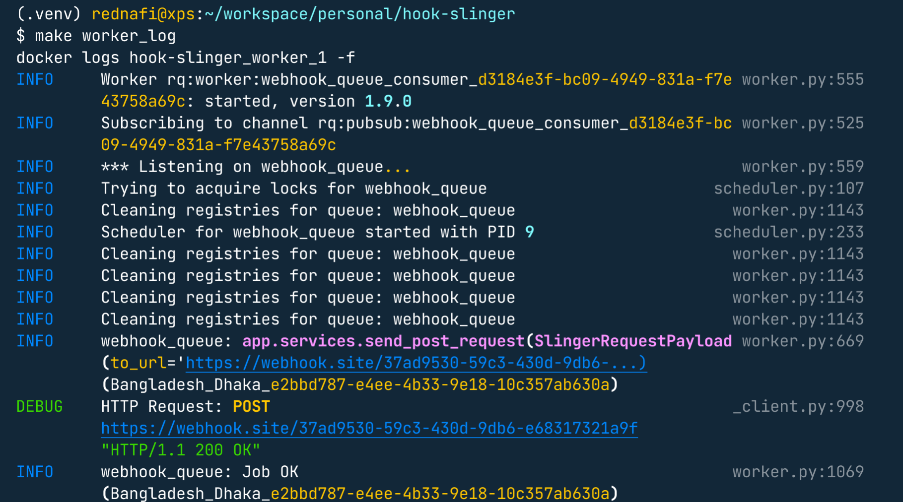


### Scaling Up the Service

Hook Slinger offers easy horizontal scale-up, powered by the `docker-compose --scale` command. In this case, scaling up means, spawning new workers in separate containers. Let's spawn 3 worker containers this time. To do so, first shut down the orchestra by running:

```
make stop_servers
```

Now, run:

```
make worker_scale n=3
```


This will start the **App server**, **Redis DB**, **RQmonitor**, and 3 **Worker** instances. Spawning multiple worker instances are a great way to achieve job concurrency with the least amount of hassle.


<div align="center">
<i> ✨ 🍰 ✨ </i>
</div>
